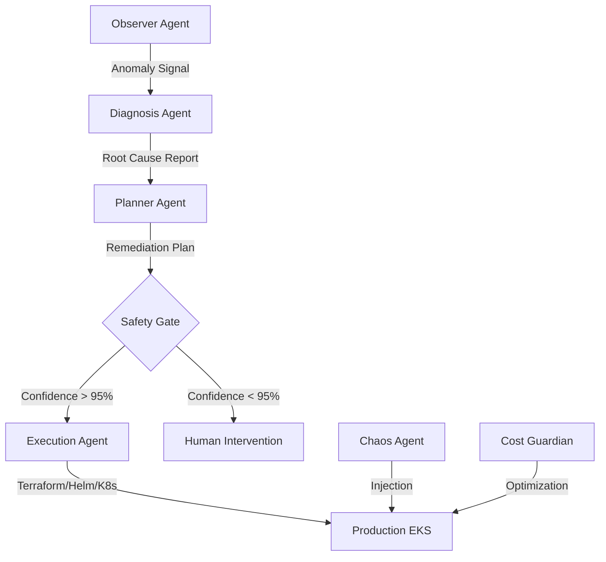

# Self-Healing Cloud Infrastructure Agent (SHCIA)

> **"Autonomous cloud infrastructure that remediates failures before humans can notice."**

[](https://opensource.org/licenses/MIT)
[](https://www.python.org/downloads/release/python-3110/)
[](https://aws.amazon.com/eks/)

---

## 🧐 Overview

SHCIA (pronounced *shia*) is an **Agentic AI Platform** designed for high-availability cloud environments. It operates as a multi-agent system that continuously monitors, diagnoses, and auto-remediates infrastructure failures across microservices with zero human intervention for known failure classes.

Built with a **FAANG-standard Monorepo** architecture, SHCIA combines the power of LLM-based causal reasoning with the durability of infrastructure-as-code (Terraform/Helm) and the stability of state-machine orchestration (LangGraph).

---

## 🏗️ Architecture



### 🧩 Core Components

| Module | Role | Technology |
| :--- | :--- | :--- |
| **Observer** | Real-time correlation of metrics and signals. | Prometheus, CloudWatch |
| **Diagnosis** | AI-powered RCA using service topology awareness. | LangChain, GPT-4, OpenAI |
| **Planner** | Generates safe, validated remediation plans. | Pydantic, Custom Logic |
| **Execution** | Durable infrastructure mutation with safety gates. | Terraform, Helm, Kubectl |
| **Chaos** | Proactive failure injection for resilience testing. | Kubernetes API |
| **Cost Guardian** | Cloud waste detection and right-sizing engine. | AWS Cost Explorer |

---

## 🚀 Quick Start

Ensure you have [Docker](https://www.docker.com/) and [Make](https://www.gnu.org/software/make/) installed.

### 1. Initialize the Environment
```bash
# Clone the repository
git clone https://github.com/Ismail-2001/Self-Healing-Cloud-Infrastructure-Agent-SHCIA-.git
cd Self-Healing-Cloud-Infrastructure-Agent-SHCIA-

# Install local development dependencies
make install-deps
```

### 2. Configure Credentials
Create a `.env` file at the root:
```env
OPENAI_API_KEY=sk-....
SHCIA_AUTH_TOKEN=super-secret-token
PROMETHEUS_URL=http://localhost:9090
```

### 3. Spin Up the Platform (Local Testing)
```bash
make build-all
docker-compose up -d
```

---

## 🛡️ Reliability & Safety

SHCIA is built on the principle of **"Safety Above Speed"**. Every automated action must pass through our **4-Gate Validation Pipeline**:

1. **Schema Validation**: Ensures the plan is structurally sound and follows defined contracts.
2. **Policy Engine (OPA)**: Validates the action against organization-wide security and compliance.
3. **Blast Radius Assessment**: Checks how many services/traffic will be impacted during remediation.
4. **Confidence Gate**: Only plans with **>95% AI Confidence** are auto-executed. Everything else is escalated for human review.

---

## 📂 Repository Layout

```text
├── libs/                # Internal shared libraries (shcia-core, shcia-contracts)
├── services/            # Microservices (agents)
│   ├── observer/        # Monitoring & Anomaly Detection
│   ├── diagnosis/       # AI Causal Reasoning
│   └── execution/       # Infrastructure Mutation
├── iac/                 # Infrastructure-as-Code (Terraform, CloudFormation)
├── ops/                 # Operational standards (Runbooks, Dashboards, Workflows)
├── deploy/              # Deployment mechanisms (Helm Charts)
└── tests/               # Unit, Integration, and E2E Test Suites
```

---

## 🤝 Contributing

We follow the standard **FAANG Pull Request Flow**. Please ensure all PRs include:
1. Updated Unit/Integration tests.
2. Updated [ADRs](file:///c:/Users/Ismail%20Sajid/Desktop/SHCIA/ops/adrs) (Architecture Decision Records) for new patterns.
3. Successful `make lint-all` and `make build-all` results.

---

## 📜 License
This project is licensed under the MIT License - see the [LICENSE](LICENSE) file for details.

---
*Built with ❤️ by the Ismail Sajid and SHCIA Engineering Team.*
